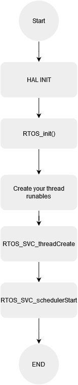
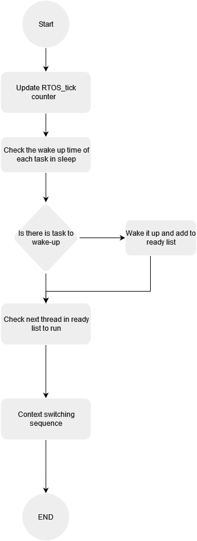

# STM32f4 Custom RTOS V1.0

Custom RTOS for STM32F4291-Discovery board.

# Table of contents

- [Introduction](#introduction)
- [RTOS features](#RTOS-features)
- [Design](#Design)
  - [Kernel start](#Kernel-start)
  - [Quantum cycle](#Quantum-cycle)
- [RTOS call APIs and configurations](#RTOS-call-APIs-and-configurations)
  - [Kernel](#Kernel)
  - [RTOS threads](#RTOS-threads)
  - [RTOS semaphore](#RTOS-semaphore)
  - [RTOS Mutex](#RTOS-Mutex)
  - [RTOS configurations](#RTOS-configurations)
- [How to use it](#how-to-use-it)
- [Upcoming features](#upcoming-features)
- [References](#references)

# Introduction

Real time operating system (RTOS) is a special type of Operating systems with time constraints.

It is responsible to manage different tasks with different priority to perform their functionality in a deterministic period of time and provides the illusion of simultaneous execution by rapidly switching between each program to apply multitasking system.

The type of an operating system is defined by how the scheduler decides which program to run and when such as primitive and non-primitive ,Event-driven and Time-driven Systems.

# RTOS features

- Primitive Round Robin Kernel
- Apply Arm instruction set in Context switching and Resource manging
- Support Semaphores, Mutex, Mailbox, Delays and timer support
- Support Priority inheritance, priority celling, and deadlock prevention
- systic based quantum

# Design

## Kernel start

we start by configuring our RTOS macros then create each thread function and its stack, then start by init our HAL layer and initialize RTOS using RTOS_init(),
after that we create our threads and set their priorities ,finally we call our RTOS schedular start to create the idle thread and start the schedular.

  
_Figure 1. RTOS start sequence._

## Quantum cycle

Firstly we update the tick counter then check if there is a task in the waiting list waiting for a specific time we start to wake up and add to the ready list finally we check which thread's turn to take its share of the processor and make the context switching

  
_Figure 2. Quantum cycle ._

# RTOS call APIs and configurations

### Kernel

- RTOS_schedulerStart
- RTOS_SVC_Handler_main
- RTOS_init

### RTOS threads

- RTOS_SVC_threadCreate
- RTOS_SVC_threadDelay
- RTOS_SVC_threadDestroy
- RTOS_SVC_threadPrioritySet

### RTOS semaphore

- RTOS_SVC_semaphoreCreate
- RTOS_SVC_semaphoreTake
- RTOS_SVC_semaphoreGive

### RTOS Mutex

- RTOS_SVC_mutexCreate
- RTOS_SVC_mutexLock
- RTOS_SVC_mutexRelease

### RTOS Milbox

- RTOS_SVC_mailboxCreate
- RTOS_SVC_mailboxWrite
- RTOS_SVC_mailboxRead

### RTOS configurations

- THREAD_STACK_SIZE
- THREAD_PRIORITY_LEVELS
- SYSTEM_CORE_CLOCK_HZ
- SYS_TICK_RATE_HZ
- USE_PRIORITY_INHERITANCE
- USE_PRIORITY_SET

# How to use it

- Create your thread runables and stack size
- Initialize your hardware used
- Initialize RTOS through RTOS_init
- Call RTOS_SVC_threadCreate for each thread
- Start the schedular

# Upcoming features

- Applying Interrupt interface to keep the modularity and encapsulation of system
- Apply different hooks such as idle task hook and tick hook
- Apply task suspend and resume
- Apply MPU to keep eye on stack and generate exception on stack overflow
- Apply deadlock prevention technique

# References

## English

- <a href="https://www.eejournal.com/article/create-your-own-rtos-in-1-hour-part-1">Create Your Own RTOS </a> Article

## Arabic

- <a href="https://www.youtube.com/playlist?list=PLPW8O6W-1chx8Y7Oq2gOE0NUPXmQxu2Wr">Event-Driven Programming Quantum Leaps</a> YouTube playlist
- <a href="https://www.youtube.com/playlist?list=PLPFp2zIiTnxVI2NdZ_yl5k2ilNCZEqOfB"> RTOS by ahmed el deeb </a> YouTube playlist
